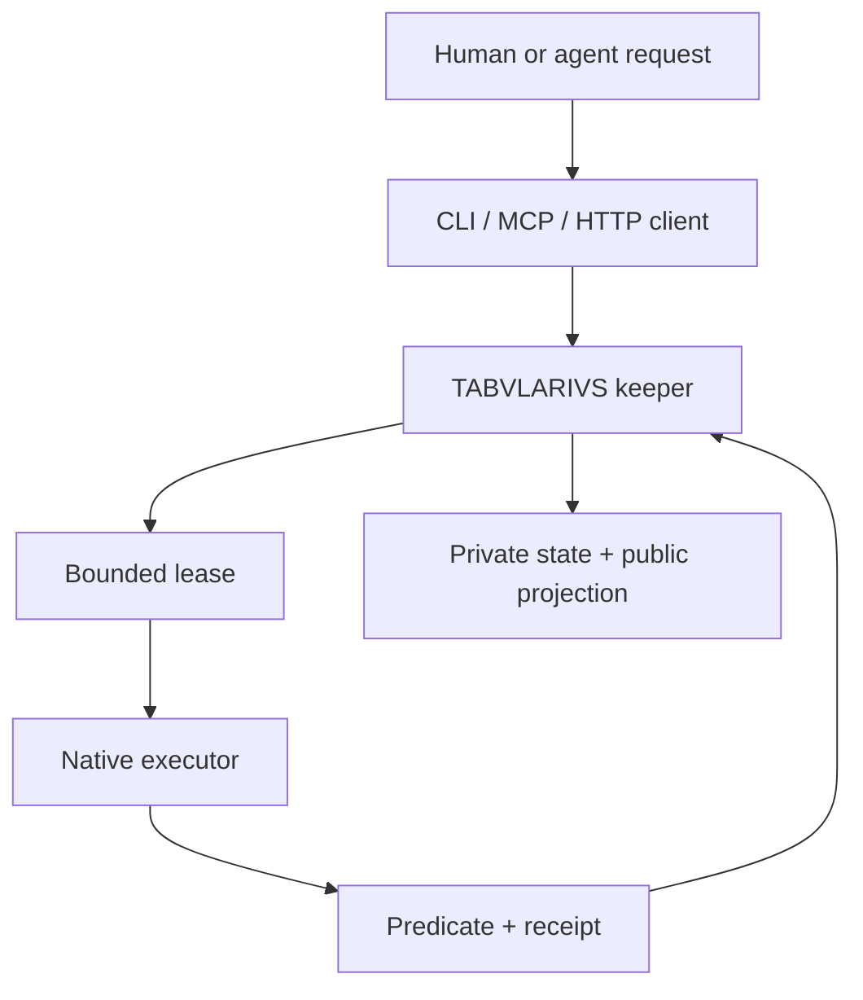

# Limen for technical readers

> A bounded conduct protocol, deterministic lease keeper, CLI/MCP clients, runtime adapters, and
> evidence-bearing lifecycle for multi-agent work.

[Project home](../../README.md) · [Protocol specification](../architecture/peer-conductor-protocol.md) ·
[Evidence record](../positioning/evidence/limen.md)

## Technical status

Limen is an **operational-internal** system. The repository implements and tests its conduct
contracts, local state adapters, web API, Cloudflare Worker keeper, dashboard surfaces, and
verification rails. A public dashboard and Worker health endpoint are deployed.

That status does not imply external customer adoption, an enterprise service-level objective, or
that every configured provider lane is continuously healthy. Runtime capability and provider
availability are discovered from live state rather than promised by this document.

## System boundary

Limen coordinates work; it is not the model that performs the work and not a substitute for a
repository's own build or test suite. Its responsibility is to bind intent, identity, authority,
resources, budget, execution, verification, and lifecycle state into one auditable protocol.



## Principal components

| Component | Responsibility | Inspect |
|---|---|---|
| Conduct models | Frozen, versioned records for identity, sessions, work packets, authority, spend, leases, attempts, and receipts | [`cli/src/limen/conduct/models.py`](../../cli/src/limen/conduct/models.py) |
| Python broker | Registration, selection, graph submission, leasing, claim, heartbeat, report, harvest, adoption, cancellation, fencing, and role checks | [`cli/src/limen/conduct/broker.py`](../../cli/src/limen/conduct/broker.py) |
| Resource model | Normalization and overlap rules for tasks, branches, paths, PR writes/reviews, worktrees, and external effects | [`cli/src/limen/conduct/resources.py`](../../cli/src/limen/conduct/resources.py) |
| Local stores | In-memory and SQLite transactional adapters for tests and local development | [`cli/src/limen/conduct/store.py`](../../cli/src/limen/conduct/store.py) |
| Portable contracts | Generated JSON Schemas and cross-runtime canonicalization vectors | [`spec/contracts/conduct/`](../../spec/contracts/conduct/) |
| CLI client | Native command surface for register, submit, split, graph, heartbeat, report, harvest, adopt, cancel, and stop | [`cli/src/limen/conduct/cli.py`](../../cli/src/limen/conduct/cli.py) |
| MCP adapter | Agent-facing protocol tools over the same lifecycle | [`mcp/src/limen_mcp/server.py`](../../mcp/src/limen_mcp/server.py) |
| Worker keeper | Authenticated remote lifecycle, Durable Object serialization, private state, and projection | [`web/worker/src/conduct/`](../../web/worker/src/conduct/) |
| API and web surfaces | Owner, QA, client, and public contracts with persona filtering and redaction | [`web/api/main.py`](../../web/api/main.py), [`web/app/app/`](../../web/app/app/) |
| Gate registry | Path-to-predicate mapping used for scoped verification | [`institutio/governance/gates.yaml`](../../institutio/governance/gates.yaml) |

## Core records

The central protocol types are:

- `AgentIdentityV1`: native agent, surface, session, and provider/run identity;
- `ConductorSessionV1`: capabilities, liveness, concurrency, quota, transport, and protection;
- `WorkPacketV1`: immutable intent/execution hashes, lineage, authority, resource claims,
  predicate, receipt target, deadline, spend, retry, depth, and fanout bounds;
- `LeaseV1`: selected executor, resource generations, observed heads, heartbeat, deadline, and
  capability binding;
- `ExecutorAttemptV1`: a monotonic provider attempt bound to one run and lease generation;
- `RunReceiptV1`: exact heads, changed paths, checks, reviews, predicate evidence, spend,
  children, and terminal outcome.

The schemas in `spec/contracts/conduct/` are the portable interchange contract. Python and
JavaScript canonical-hash fixtures guard cross-runtime identity behavior.

## Lifecycle and concurrency

1. A native session registers its actual capabilities, liveness, worktree, and protection state.
2. A conductor submits a packet or an atomic graph of packets.
3. The keeper validates authority, work-loan and lineage constraints, resource conflicts, budget,
   retry limits, and an eligible executor.
4. The selected executor claims a generation-bound capability through its own authenticated role.
5. Heartbeats preserve the lease only while its resource generations and exact heads remain valid.
6. The executor reports a typed receipt.
7. The keeper validates the receipt, updates the graph/lifecycle, and exposes only the appropriate
   private or public projection.

Delegation forms a bounded directed acyclic graph. A child cannot exceed its parent's repository,
path, authority, spend, retry, deadline, depth, or fanout envelope. Repeated ancestry work keys are
rejected. Resource claims are normalized and acquired deterministically; overlapping exclusive
claims serialize while compatible review claims may coexist.

## Interfaces

The CLI and MCP surfaces expose the same conduct verbs. The HTTP runtime adds authenticated graph,
lease, task-compatibility, status, and persona routes. See the
[peer conductor protocol](../architecture/peer-conductor-protocol.md) for the current operation map
and the [root README](../../README.md#cli-reference) for the broader CLI reference.

`tasks.yaml` is a read-only projection of keeper-owned state. Local/inline adapters remain writable
for contract tests. GitHub-backed runtime adapters defer canonical mutations to TABVLARIVS rather
than allowing an API client to write the default branch directly.

## Security and human-approval boundaries

- Authenticated runtime roles distinguish observer, conductor, executor, and compatibility
  principals.
- A conductor does not receive executor capability material; an executor claims through its own
  authenticated route.
- Capabilities are bound to lease ID, generation, and executor principal.
- Public lease representations omit secret material.
- Direct human sessions can register as `human_protected`; autonomous peers cannot select, adopt,
  cancel, signal, retune, or reap them.
- External effects must be declared in the authority envelope and resource claims.
- Owner, client, and public API personas receive different sanctioned surfaces; public projections
  omit task and dispatch-log detail.
- Credentials are configuration requirements, not repository content. Protected end-to-end
  reproduction therefore requires an authorized environment.

These controls are implementation boundaries, not a claim of formal security certification.

## Failure modes

| Condition | Expected behavior | Evidence boundary |
|---|---|---|
| Authenticated keeper unavailable | New canonical claims fail closed | Existing leased/local inspection may continue; availability is not guaranteed |
| Overlapping exclusive resource | Conflicting lease is refused or serialized | Covered by resource and race tests |
| Exact head moves | Lease is fenced; late receipt remains evidence only | Covered by conduct protocol tests |
| Child exceeds parent authority | Split is rejected | Covered by authority attenuation tests |
| Predicate fails | Receipt cannot produce a successful terminal outcome | Covered by receipt/predicate tests |
| Executor attempt is transient | Retry/reroute is bounded by packet policy and spend | No unlimited retry promise |
| Conductor disappears | Live children are not automatically cancelled; eligible adoption requires absence proof | Protected sessions remain non-adoptable |
| Public projection unavailable or stale | Private operation cannot be inferred from a missing or old aggregate | Deployment liveness is a dated observation, not an SLA |

## Installation and execution

Use the [Quickstart](../../QUICKSTART.md) and the [Usage section](../../README.md#usage) for the
current install and local stack commands. Production conduct requires an authenticated HTTPS keeper
configured through `LIMEN_CONDUCT_URL` and `LIMEN_CONDUCT_TOKEN`; the local SQLite adapter is for
development and tests.

Before using a command that mutates an external system, read the operating contract in
[`AGENTS.md`](../../AGENTS.md). It distinguishes direct human sessions from autonomous dispatch and
defines the keeper-owned lifecycle.

## Verification map

Focused checks relevant to the claims on this page include:

```bash
bash scripts/run-pytest-hermetic.sh \
  cli/tests/test_conduct_protocol.py \
  cli/tests/test_conduct_roles.py \
  cli/tests/test_conduct_auth.py \
  -q

bash scripts/run-pytest-hermetic.sh web/api/tests/test_main.py -q

npm --prefix web/worker run check
```

Repository changes should use:

```bash
scripts/verify-scoped.sh
```

The whole-repository predicate is `scripts/verify-whole.sh`. Live runtime and authenticated canary
checks are separate, environment-dependent evidence; a green offline suite must not be presented as
a fresh production canary.

## Known technical limits

- The public runtime proves reachability and declared storage mode at an observation time, not
  long-window reliability.
- The public status projection is intentionally redacted and can be temporally behind private
  operation.
- Multi-provider adapter code and lane declarations do not prove that every provider is funded,
  authenticated, healthy, or accepting work at this moment.
- Local broker tests do not replace the authenticated full-mesh production canary.
- No public benchmark establishes performance or cost superiority over other orchestration systems.
- The repository has no committed license file at this verification point.

Canonical statuses and evidence references are recorded in
[`project-record.yml`](../../project-record.yml) and the
[public evidence packet](../positioning/evidence/limen.md).
