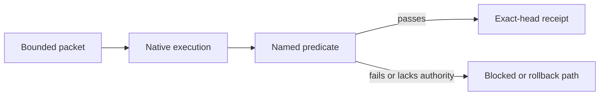

# Derived assets — private copy deck

> **Private staging only.** These are compact pointers to a future canonical report; none may be posted, queued, or sent.

## W03 — Agentic-delivery failure modes

**Article premise:** A multi-agent system can fail even when an individual patch looks plausible. The useful diagnostic frame is ownership: who had authority, what predicate was run, what receipt exists, and how does rollback work?

**Admitted framing:** This is a method-level observation grounded in the governed delivery model. It makes no claim about market prevalence, customer losses, or comparative superiority.

**Diagram asset:** [`assets/delivery-gates-flow.svg`](assets/delivery-gates-flow.svg) — `authority → bounded packet → native execution → predicate → receipt → rollback or accepted state`.

**Audit CTA:** “Inspect the control loop behind the claim.”

## W04 — Control economics, not activity volume

**Article premise:** A metric is only useful if another person can reproduce its definition, scope, time range, and limitations. Raw token or commit volume is not a substitute for that method.

**Withheld fields:** currency, spend, savings, throughput, ROI, and comparative performance.

**Audit CTA:** “Ask for the metric definition before accepting the conclusion.”

## W05 — Delivery-gates walkthrough

**Synthetic example:** A fictional documentation change is authorized for one repository path. It is checked against a named predicate and either produces a revision-tied receipt or remains blocked. No user, credential, customer, or production event is represented.

**Audit CTA:** “Trace an action from authority through verification.”

## W06 — Correction-case-study shell

**Status:** synthetic drill only; no real incident is claimed.

| Field | Staged treatment |
|---|---|
| Timeline | Use a fictional sequence until a sanitized, verifiable source is admitted. |
| Impact | State only the demonstrated scope; never infer customer or commercial impact. |
| Cause | Mark as unknown unless an evidence-backed causal finding exists. |
| Detection | Name the predicate or monitor that detected the synthetic failure. |
| Repair | Link to a reversible corrective change and its verification. |
| Prevention | Phrase as a testable control, not a guarantee. |
| Limits | State what the control does not establish. |

## W07 — channel pointer drafts

All copies must resolve to one canonical report URL and retain the indicated door tag after release approval.

- **Technical thread:** “A system is not governed because it has agents. The proof is whether each consequential action has authority, a predicate, a receipt, and a rollback path. [canonical report — `deploy`]”
- **Newsletter blurb:** “A private draft on the engineering controls behind governed multi-agent delivery: method, failures, and reproducible evidence — not activity theater. [canonical report — `deploy`]”
- **Community post:** “Sharing a method note on making multi-agent work attributable and reversible. It intentionally distinguishes internal operating evidence from customer proof. [canonical report — `deploy`]”
- **Recruiter-facing pointer:** “A short engineering report on the system design and disclosed machine-assisted method behind a governed delivery practice. [canonical report — `hire`]”

Replace `[canonical report]` only after W02 is genuinely released. Each pointer expires 30 days after an approved release and must be re-reviewed against the source register before reuse. Do not shorten, redirect, or add tracking outside the approved measurement contract.
