# Production-Systems Program execution chunks

Generated from `institutio/positioning/program.yaml`. Do not edit by hand. The manifest and live GitHub state outrank this projection.

These prompts are conductor envelopes: the chunk conductor coordinates the work, while every leaf retains its own exact model/effort assignment, lease, authority boundary, predicate, and receipt.

## Dependency order

```mermaid
flowchart LR
  PSP-C00["PSP-C00 · Land the program control plane"]
  PSP-C01["PSP-C01 · Repair and freeze the foundation"]
  PSP-C02["PSP-C02 · Establish estate truth and evidence"]
  PSP-C03["PSP-C03 · Ratify identity and commercial offers"]
  PSP-C04["PSP-C04 · Produce proof and design the experience"]
  PSP-C05["PSP-C05 · Build the service-delivery operating system"]
  PSP-C06["PSP-C06 · Implement and verify public surfaces"]
  PSP-C07["PSP-C07 · Build private inbound operations"]
  PSP-C08["PSP-C08 · Stage and distribute proof-led content"]
  PSP-C09["PSP-C09 · Build qualification and conversion before the pilot"]
  PSP-C10["PSP-C10 · Obtain commercial proof and close the demand experiment"]
  PSP-C11["PSP-C11 · Prove the governed foundry handoff"]
  PSP-C12["PSP-C12 · Close the return loops and prove Omega"]
  PSP-C00 --> PSP-C01
  PSP-C01 --> PSP-C02
  PSP-C02 --> PSP-C03
  PSP-C03 --> PSP-C04
  PSP-C03 --> PSP-C05
  PSP-C04 --> PSP-C06
  PSP-C06 --> PSP-C07
  PSP-C07 --> PSP-C08
  PSP-C05 --> PSP-C09
  PSP-C08 --> PSP-C09
  PSP-C05 --> PSP-C10
  PSP-C09 --> PSP-C10
  PSP-C10 --> PSP-C11
  PSP-C11 --> PSP-C12
```



C04 (proof/experience) and C05 (service delivery) may run in parallel after C03. They rejoin before commercial validation. C10 intentionally interleaves P12 with P10-W08: P12-W02 unlocks P10-W08, eliminating the former P10↔P12 phase-gating deadlock.

## Chunk index

| Chunk | Scope | Conductor | Depends on | Leaves | Exit gate |
|---|---|---|---|---:|---|
| `PSP-C00` Land the program control plane | `PSP-P00` | `gpt-5.6-sol` / `max` | — | 7 | P00 is closed; model validation, issue parity, ready-work discovery, packet seeding, and broker integration are green. |
| `PSP-C01` Repair and freeze the foundation | `PSP-P01` | `gpt-5.6-terra` / `high` | `PSP-C00` | 5 | P01 is closed and PRs 2136 and 2141 have terminal durable owners with a frozen baseline receipt. |
| `PSP-C02` Establish estate truth and evidence | `PSP-P02` | `gpt-5.6-sol` / `max` | `PSP-C01` | 8 | P02 is closed; every selected flagship and material claim has current, reproducible, privacy-reviewed evidence. |
| `PSP-C03` Ratify identity and commercial offers | `PSP-P03`, `PSP-P04` | `gpt-5.6-sol` / `max` | `PSP-C02` | 14 | P03 and P04 are closed; target readers understand the offer and each commercial path has bounded scope and economics. |
| `PSP-C04` Produce proof and design the experience | `PSP-P05`, `PSP-P06` | `gpt-5.6-sol` / `xhigh` | `PSP-C03` | 13 | P05 and P06 are closed; public-safe proof exists and the approved experience passes visual, comprehension, accessibility, and performance gates. |
| `PSP-C05` Build the service-delivery operating system | `PSP-P11` | `gpt-5.6-sol` / `max` | `PSP-C03` | 8 | P11 is closed and a synthetic engagement traverses the complete delivery lifecycle under declared security boundaries. |
| `PSP-C06` Implement and verify public surfaces | `PSP-P07` | `gpt-5.6-terra` / `high` | `PSP-C04` | 9 | P07 is closed and every tracked public surface is coherent, live, linked, measurable, and rollback-safe. |
| `PSP-C07` Build private inbound operations | `PSP-P08` | `gpt-5.6-sol` / `xhigh` | `PSP-C06` | 7 | P08 is closed and synthetic client and recruiter leads traverse the complete private funnel while the send valve remains closed. |
| `PSP-C08` Stage and distribute proof-led content | `PSP-P09` | `gpt-5.6-terra` / `high` | `PSP-C07` | 8 | P09 is closed; the proof-led series is staged or owner-published where approved, measured, and connected to qualified capture. |
| `PSP-C09` Build qualification and conversion before the pilot | `PSP-P10` − `PSP-P10-W08` | `gpt-5.6-sol` / `xhigh` | `PSP-C05`, `PSP-C08` | 7 | P10-W01 through P10-W07 are closed with receipts; only the post-pilot 90-day experiment adjudication remains open in P10. |
| `PSP-C10` Obtain commercial proof and close the demand experiment | `PSP-P12` + `PSP-P10-W08` | `gpt-5.6-sol` / `max` | `PSP-C05`, `PSP-C09` | 7 | P10 and P12 are closed with either commercial proof or an evidence-backed wedge invalidation and revision receipt. |
| `PSP-C11` Prove the governed foundry handoff | `PSP-P13` | `gpt-5.6-sol` / `max` | `PSP-C10` | 9 | P13 is closed and one product reaches observed operator transfer or an evidence-backed no-go decision. |
| `PSP-C12` Close the return loops and prove Omega | `PSP-P14` | `gpt-5.6-sol` / `ultra` | `PSP-C11` | 9 | P14 and the root program are closed after two unchanged remote checks satisfy the terminal Omega predicate. |

## How to use the prompts

1. Start with C00. Do not launch a chunk until every named predecessor has a durable completion receipt.
2. C04 and C05 are the only intended parallel branch. Run them in isolated worktrees and broker leases.
3. Paste one prompt below into a fresh conductor session using its assigned model/effort.
4. If a session exhausts context or usage, use `RELAY-TEMPLATE.md`; the next agent resumes the same chunk rather than skipping ahead.
5. The live `--ready --json` result controls which leaf starts next. Issue numbers are not execution order.

## 1. PSP-C00 — Land the program control plane

Copy and paste:

```text
Execute Production-Systems Program chunk PSP-C00: Land the program control plane.

Run this conductor session with `gpt-5.6-sol` at `max` effort. Leaf executors must use the exact model/effort assignment on each issue; never silently substitute.

Scope
- Repository: `organvm/limen`
- Root program: https://github.com/organvm/limen/issues/2157
- Bootstrap: Continue draft PR #2156 on branch `codex/production-systems-program`; do not recreate the graph or its issues. Use the repository merge rail only when live authority permits it.
- Phase scope: PSP-P00
- Resolved leaf count: 7
- Excluded leaves: none
- Extra cross-phase leaves: none
- Required predecessor chunks: none
- Objective: Land the existing program PR, close the seven control-plane leaves with receipts, and prove remote parity.
- Exit gate: P00 is closed; model validation, issue parity, ready-work discovery, packet seeding, and broker integration are green.

Execution contract
1. Start from live remote state. Read `AGENTS.md`, `institutio/positioning/program.yaml`, `docs/positioning/program/AGENT-RUNBOOK.md`, `docs/positioning/program/EXECUTION-CHUNKS.md`, and the root/phase/leaf GitHub issues. Do not trust this prompt over newer tracked state.
2. Run `python3 scripts/positioning-program.py --check`, `--verify-remote`, and `--verify-model-assignments`. Then run `python3 scripts/positioning-program.py --chunk PSP-C00` and `--ready --json`.
3. Work only on leaves that are both in this chunk's resolved scope and currently ready. For each leaf, run `--seed <WORK-ID>`, obtain a conduct-broker lease before mutation, preserve native agent identity, and honor its exact repository/path/effect/authority boundary.
4. Drive dependencies to the chunk exit gate. Independent ready leaves may run in parallel only after separate broker reservations. Do not redo a green exact-head predicate or overwrite sibling work.
5. A leaf closes only after its executable predicate passes and a structured durable receipt is attached. A phase closes only after every child and its phase exit gate pass. GitHub prose, an open branch, or an unmerged draft is not completion.
6. Do not send, publish, change DNS, spend, sign, merge, expose private evidence, or mutate an account unless live authority explicitly permits that exact act. Stage reversible work, record the named human gate once, and continue every other safe lane.
7. If the session ends before the chunk closes, create a new dated envelope from `docs/positioning/program/RELAY-TEMPLATE.md` under `docs/receipts/positioning/relays/`, commit and push it, and attach it to the owning issue/PR. Then create the target agent's local pickup pointer when supported. Return the canonical phrase: `Continue from relay at <absolute-pointer-path>. mid-task — see Next Actions for current step.` The relay transfers context, never lease or approval.
8. Stop only when the chunk exit gate is verified or an irreducible external blocker has a durable owner.

Return exactly: chunk status; closed and open work IDs; commits/PRs/issue receipts; predicate results; human gates; next ready IDs; and the relay pointer when incomplete.
```

## 2. PSP-C01 — Repair and freeze the foundation

Copy and paste:

```text
Execute Production-Systems Program chunk PSP-C01: Repair and freeze the foundation.

Run this conductor session with `gpt-5.6-terra` at `high` effort. Leaf executors must use the exact model/effort assignment on each issue; never silently substitute.

Scope
- Repository: `organvm/limen`
- Root program: https://github.com/organvm/limen/issues/2157
- Bootstrap: Start from current `main` only after C00 is closed and PR #2156 has landed; otherwise stop and resume C00.
- Phase scope: PSP-P01
- Resolved leaf count: 5
- Excluded leaves: none
- Extra cross-phase leaves: none
- Required predecessor chunks: PSP-C00
- Objective: Land the upstream truth and private-custody foundations, reconcile generators, and freeze the post-merge baseline.
- Exit gate: P01 is closed and PRs 2136 and 2141 have terminal durable owners with a frozen baseline receipt.

Execution contract
1. Start from live remote state. Read `AGENTS.md`, `institutio/positioning/program.yaml`, `docs/positioning/program/AGENT-RUNBOOK.md`, `docs/positioning/program/EXECUTION-CHUNKS.md`, and the root/phase/leaf GitHub issues. Do not trust this prompt over newer tracked state.
2. Run `python3 scripts/positioning-program.py --check`, `--verify-remote`, and `--verify-model-assignments`. Then run `python3 scripts/positioning-program.py --chunk PSP-C01` and `--ready --json`.
3. Work only on leaves that are both in this chunk's resolved scope and currently ready. For each leaf, run `--seed <WORK-ID>`, obtain a conduct-broker lease before mutation, preserve native agent identity, and honor its exact repository/path/effect/authority boundary.
4. Drive dependencies to the chunk exit gate. Independent ready leaves may run in parallel only after separate broker reservations. Do not redo a green exact-head predicate or overwrite sibling work.
5. A leaf closes only after its executable predicate passes and a structured durable receipt is attached. A phase closes only after every child and its phase exit gate pass. GitHub prose, an open branch, or an unmerged draft is not completion.
6. Do not send, publish, change DNS, spend, sign, merge, expose private evidence, or mutate an account unless live authority explicitly permits that exact act. Stage reversible work, record the named human gate once, and continue every other safe lane.
7. If the session ends before the chunk closes, create a new dated envelope from `docs/positioning/program/RELAY-TEMPLATE.md` under `docs/receipts/positioning/relays/`, commit and push it, and attach it to the owning issue/PR. Then create the target agent's local pickup pointer when supported. Return the canonical phrase: `Continue from relay at <absolute-pointer-path>. mid-task — see Next Actions for current step.` The relay transfers context, never lease or approval.
8. Stop only when the chunk exit gate is verified or an irreducible external blocker has a durable owner.

Return exactly: chunk status; closed and open work IDs; commits/PRs/issue receipts; predicate results; human gates; next ready IDs; and the relay pointer when incomplete.
```

## 3. PSP-C02 — Establish estate truth and evidence

Copy and paste:

```text
Execute Production-Systems Program chunk PSP-C02: Establish estate truth and evidence.

Run this conductor session with `gpt-5.6-sol` at `max` effort. Leaf executors must use the exact model/effort assignment on each issue; never silently substitute.

Scope
- Repository: `organvm/limen`
- Root program: https://github.com/organvm/limen/issues/2157
- Bootstrap: Start from current `main` only after C00 is closed and PR #2156 has landed; otherwise stop and resume C00.
- Phase scope: PSP-P02
- Resolved leaf count: 8
- Excluded leaves: none
- Extra cross-phase leaves: none
- Required predecessor chunks: PSP-C01
- Objective: Discover the full owned estate, select flagships, build reproducible evidence packets, and adjudicate contested claims.
- Exit gate: P02 is closed; every selected flagship and material claim has current, reproducible, privacy-reviewed evidence.

Execution contract
1. Start from live remote state. Read `AGENTS.md`, `institutio/positioning/program.yaml`, `docs/positioning/program/AGENT-RUNBOOK.md`, `docs/positioning/program/EXECUTION-CHUNKS.md`, and the root/phase/leaf GitHub issues. Do not trust this prompt over newer tracked state.
2. Run `python3 scripts/positioning-program.py --check`, `--verify-remote`, and `--verify-model-assignments`. Then run `python3 scripts/positioning-program.py --chunk PSP-C02` and `--ready --json`.
3. Work only on leaves that are both in this chunk's resolved scope and currently ready. For each leaf, run `--seed <WORK-ID>`, obtain a conduct-broker lease before mutation, preserve native agent identity, and honor its exact repository/path/effect/authority boundary.
4. Drive dependencies to the chunk exit gate. Independent ready leaves may run in parallel only after separate broker reservations. Do not redo a green exact-head predicate or overwrite sibling work.
5. A leaf closes only after its executable predicate passes and a structured durable receipt is attached. A phase closes only after every child and its phase exit gate pass. GitHub prose, an open branch, or an unmerged draft is not completion.
6. Do not send, publish, change DNS, spend, sign, merge, expose private evidence, or mutate an account unless live authority explicitly permits that exact act. Stage reversible work, record the named human gate once, and continue every other safe lane.
7. If the session ends before the chunk closes, create a new dated envelope from `docs/positioning/program/RELAY-TEMPLATE.md` under `docs/receipts/positioning/relays/`, commit and push it, and attach it to the owning issue/PR. Then create the target agent's local pickup pointer when supported. Return the canonical phrase: `Continue from relay at <absolute-pointer-path>. mid-task — see Next Actions for current step.` The relay transfers context, never lease or approval.
8. Stop only when the chunk exit gate is verified or an irreducible external blocker has a durable owner.

Return exactly: chunk status; closed and open work IDs; commits/PRs/issue receipts; predicate results; human gates; next ready IDs; and the relay pointer when incomplete.
```

## 4. PSP-C03 — Ratify identity and commercial offers

Copy and paste:

```text
Execute Production-Systems Program chunk PSP-C03: Ratify identity and commercial offers.

Run this conductor session with `gpt-5.6-sol` at `max` effort. Leaf executors must use the exact model/effort assignment on each issue; never silently substitute.

Scope
- Repository: `organvm/limen`
- Root program: https://github.com/organvm/limen/issues/2157
- Bootstrap: Start from current `main` only after C00 is closed and PR #2156 has landed; otherwise stop and resume C00.
- Phase scope: PSP-P03, PSP-P04
- Resolved leaf count: 14
- Excluded leaves: none
- Extra cross-phase leaves: none
- Required predecessor chunks: PSP-C02
- Objective: Ratify the production-systems identity, audience narratives, offer ladder, qualification rules, economics, and commercial templates.
- Exit gate: P03 and P04 are closed; target readers understand the offer and each commercial path has bounded scope and economics.

Execution contract
1. Start from live remote state. Read `AGENTS.md`, `institutio/positioning/program.yaml`, `docs/positioning/program/AGENT-RUNBOOK.md`, `docs/positioning/program/EXECUTION-CHUNKS.md`, and the root/phase/leaf GitHub issues. Do not trust this prompt over newer tracked state.
2. Run `python3 scripts/positioning-program.py --check`, `--verify-remote`, and `--verify-model-assignments`. Then run `python3 scripts/positioning-program.py --chunk PSP-C03` and `--ready --json`.
3. Work only on leaves that are both in this chunk's resolved scope and currently ready. For each leaf, run `--seed <WORK-ID>`, obtain a conduct-broker lease before mutation, preserve native agent identity, and honor its exact repository/path/effect/authority boundary.
4. Drive dependencies to the chunk exit gate. Independent ready leaves may run in parallel only after separate broker reservations. Do not redo a green exact-head predicate or overwrite sibling work.
5. A leaf closes only after its executable predicate passes and a structured durable receipt is attached. A phase closes only after every child and its phase exit gate pass. GitHub prose, an open branch, or an unmerged draft is not completion.
6. Do not send, publish, change DNS, spend, sign, merge, expose private evidence, or mutate an account unless live authority explicitly permits that exact act. Stage reversible work, record the named human gate once, and continue every other safe lane.
7. If the session ends before the chunk closes, create a new dated envelope from `docs/positioning/program/RELAY-TEMPLATE.md` under `docs/receipts/positioning/relays/`, commit and push it, and attach it to the owning issue/PR. Then create the target agent's local pickup pointer when supported. Return the canonical phrase: `Continue from relay at <absolute-pointer-path>. mid-task — see Next Actions for current step.` The relay transfers context, never lease or approval.
8. Stop only when the chunk exit gate is verified or an irreducible external blocker has a durable owner.

Return exactly: chunk status; closed and open work IDs; commits/PRs/issue receipts; predicate results; human gates; next ready IDs; and the relay pointer when incomplete.
```

## 5. PSP-C04 — Produce proof and design the experience

Copy and paste:

```text
Execute Production-Systems Program chunk PSP-C04: Produce proof and design the experience.

Run this conductor session with `gpt-5.6-sol` at `xhigh` effort. Leaf executors must use the exact model/effort assignment on each issue; never silently substitute.

Scope
- Repository: `organvm/limen`
- Root program: https://github.com/organvm/limen/issues/2157
- Bootstrap: Start from current `main` only after C00 is closed and PR #2156 has landed; otherwise stop and resume C00.
- Phase scope: PSP-P05, PSP-P06
- Resolved leaf count: 13
- Excluded leaves: none
- Extra cross-phase leaves: none
- Required predecessor chunks: PSP-C03
- Objective: Produce the flagship proof classes and turn them into a tested, accessible progressive-disclosure experience.
- Exit gate: P05 and P06 are closed; public-safe proof exists and the approved experience passes visual, comprehension, accessibility, and performance gates.

Execution contract
1. Start from live remote state. Read `AGENTS.md`, `institutio/positioning/program.yaml`, `docs/positioning/program/AGENT-RUNBOOK.md`, `docs/positioning/program/EXECUTION-CHUNKS.md`, and the root/phase/leaf GitHub issues. Do not trust this prompt over newer tracked state.
2. Run `python3 scripts/positioning-program.py --check`, `--verify-remote`, and `--verify-model-assignments`. Then run `python3 scripts/positioning-program.py --chunk PSP-C04` and `--ready --json`.
3. Work only on leaves that are both in this chunk's resolved scope and currently ready. For each leaf, run `--seed <WORK-ID>`, obtain a conduct-broker lease before mutation, preserve native agent identity, and honor its exact repository/path/effect/authority boundary.
4. Drive dependencies to the chunk exit gate. Independent ready leaves may run in parallel only after separate broker reservations. Do not redo a green exact-head predicate or overwrite sibling work.
5. A leaf closes only after its executable predicate passes and a structured durable receipt is attached. A phase closes only after every child and its phase exit gate pass. GitHub prose, an open branch, or an unmerged draft is not completion.
6. Do not send, publish, change DNS, spend, sign, merge, expose private evidence, or mutate an account unless live authority explicitly permits that exact act. Stage reversible work, record the named human gate once, and continue every other safe lane.
7. If the session ends before the chunk closes, create a new dated envelope from `docs/positioning/program/RELAY-TEMPLATE.md` under `docs/receipts/positioning/relays/`, commit and push it, and attach it to the owning issue/PR. Then create the target agent's local pickup pointer when supported. Return the canonical phrase: `Continue from relay at <absolute-pointer-path>. mid-task — see Next Actions for current step.` The relay transfers context, never lease or approval.
8. Stop only when the chunk exit gate is verified or an irreducible external blocker has a durable owner.

Return exactly: chunk status; closed and open work IDs; commits/PRs/issue receipts; predicate results; human gates; next ready IDs; and the relay pointer when incomplete.
```

## 6. PSP-C05 — Build the service-delivery operating system

Copy and paste:

```text
Execute Production-Systems Program chunk PSP-C05: Build the service-delivery operating system.

Run this conductor session with `gpt-5.6-sol` at `max` effort. Leaf executors must use the exact model/effort assignment on each issue; never silently substitute.

Scope
- Repository: `organvm/limen`
- Root program: https://github.com/organvm/limen/issues/2157
- Bootstrap: Start from current `main` only after C00 is closed and PR #2156 has landed; otherwise stop and resume C00.
- Phase scope: PSP-P11
- Resolved leaf count: 8
- Excluded leaves: none
- Extra cross-phase leaves: none
- Required predecessor chunks: PSP-C03
- Objective: Build and prove the audit, install, retainer, client workspace, QA, handoff, and consent operating system.
- Exit gate: P11 is closed and a synthetic engagement traverses the complete delivery lifecycle under declared security boundaries.

Execution contract
1. Start from live remote state. Read `AGENTS.md`, `institutio/positioning/program.yaml`, `docs/positioning/program/AGENT-RUNBOOK.md`, `docs/positioning/program/EXECUTION-CHUNKS.md`, and the root/phase/leaf GitHub issues. Do not trust this prompt over newer tracked state.
2. Run `python3 scripts/positioning-program.py --check`, `--verify-remote`, and `--verify-model-assignments`. Then run `python3 scripts/positioning-program.py --chunk PSP-C05` and `--ready --json`.
3. Work only on leaves that are both in this chunk's resolved scope and currently ready. For each leaf, run `--seed <WORK-ID>`, obtain a conduct-broker lease before mutation, preserve native agent identity, and honor its exact repository/path/effect/authority boundary.
4. Drive dependencies to the chunk exit gate. Independent ready leaves may run in parallel only after separate broker reservations. Do not redo a green exact-head predicate or overwrite sibling work.
5. A leaf closes only after its executable predicate passes and a structured durable receipt is attached. A phase closes only after every child and its phase exit gate pass. GitHub prose, an open branch, or an unmerged draft is not completion.
6. Do not send, publish, change DNS, spend, sign, merge, expose private evidence, or mutate an account unless live authority explicitly permits that exact act. Stage reversible work, record the named human gate once, and continue every other safe lane.
7. If the session ends before the chunk closes, create a new dated envelope from `docs/positioning/program/RELAY-TEMPLATE.md` under `docs/receipts/positioning/relays/`, commit and push it, and attach it to the owning issue/PR. Then create the target agent's local pickup pointer when supported. Return the canonical phrase: `Continue from relay at <absolute-pointer-path>. mid-task — see Next Actions for current step.` The relay transfers context, never lease or approval.
8. Stop only when the chunk exit gate is verified or an irreducible external blocker has a durable owner.

Return exactly: chunk status; closed and open work IDs; commits/PRs/issue receipts; predicate results; human gates; next ready IDs; and the relay pointer when incomplete.
```

## 7. PSP-C06 — Implement and verify public surfaces

Copy and paste:

```text
Execute Production-Systems Program chunk PSP-C06: Implement and verify public surfaces.

Run this conductor session with `gpt-5.6-terra` at `high` effort. Leaf executors must use the exact model/effort assignment on each issue; never silently substitute.

Scope
- Repository: `organvm/limen`
- Root program: https://github.com/organvm/limen/issues/2157
- Bootstrap: Start from current `main` only after C00 is closed and PR #2156 has landed; otherwise stop and resume C00.
- Phase scope: PSP-P07
- Resolved leaf count: 9
- Excluded leaves: none
- Extra cross-phase leaves: none
- Required predecessor chunks: PSP-C04
- Objective: Implement the profile, organization map, portfolio, resume, repositories, identity package, domains, and analytics.
- Exit gate: P07 is closed and every tracked public surface is coherent, live, linked, measurable, and rollback-safe.

Execution contract
1. Start from live remote state. Read `AGENTS.md`, `institutio/positioning/program.yaml`, `docs/positioning/program/AGENT-RUNBOOK.md`, `docs/positioning/program/EXECUTION-CHUNKS.md`, and the root/phase/leaf GitHub issues. Do not trust this prompt over newer tracked state.
2. Run `python3 scripts/positioning-program.py --check`, `--verify-remote`, and `--verify-model-assignments`. Then run `python3 scripts/positioning-program.py --chunk PSP-C06` and `--ready --json`.
3. Work only on leaves that are both in this chunk's resolved scope and currently ready. For each leaf, run `--seed <WORK-ID>`, obtain a conduct-broker lease before mutation, preserve native agent identity, and honor its exact repository/path/effect/authority boundary.
4. Drive dependencies to the chunk exit gate. Independent ready leaves may run in parallel only after separate broker reservations. Do not redo a green exact-head predicate or overwrite sibling work.
5. A leaf closes only after its executable predicate passes and a structured durable receipt is attached. A phase closes only after every child and its phase exit gate pass. GitHub prose, an open branch, or an unmerged draft is not completion.
6. Do not send, publish, change DNS, spend, sign, merge, expose private evidence, or mutate an account unless live authority explicitly permits that exact act. Stage reversible work, record the named human gate once, and continue every other safe lane.
7. If the session ends before the chunk closes, create a new dated envelope from `docs/positioning/program/RELAY-TEMPLATE.md` under `docs/receipts/positioning/relays/`, commit and push it, and attach it to the owning issue/PR. Then create the target agent's local pickup pointer when supported. Return the canonical phrase: `Continue from relay at <absolute-pointer-path>. mid-task — see Next Actions for current step.` The relay transfers context, never lease or approval.
8. Stop only when the chunk exit gate is verified or an irreducible external blocker has a durable owner.

Return exactly: chunk status; closed and open work IDs; commits/PRs/issue receipts; predicate results; human gates; next ready IDs; and the relay pointer when incomplete.
```

## 8. PSP-C07 — Build private inbound operations

Copy and paste:

```text
Execute Production-Systems Program chunk PSP-C07: Build private inbound operations.

Run this conductor session with `gpt-5.6-sol` at `xhigh` effort. Leaf executors must use the exact model/effort assignment on each issue; never silently substitute.

Scope
- Repository: `organvm/limen`
- Root program: https://github.com/organvm/limen/issues/2157
- Bootstrap: Start from current `main` only after C00 is closed and PR #2156 has landed; otherwise stop and resume C00.
- Phase scope: PSP-P08
- Resolved leaf count: 7
- Excluded leaves: none
- Extra cross-phase leaves: none
- Required predecessor chunks: PSP-C06
- Objective: Build tagged intake, normalization, scoring, routing, drafting, and the private opportunity ledger with no-send enforced.
- Exit gate: P08 is closed and synthetic client and recruiter leads traverse the complete private funnel while the send valve remains closed.

Execution contract
1. Start from live remote state. Read `AGENTS.md`, `institutio/positioning/program.yaml`, `docs/positioning/program/AGENT-RUNBOOK.md`, `docs/positioning/program/EXECUTION-CHUNKS.md`, and the root/phase/leaf GitHub issues. Do not trust this prompt over newer tracked state.
2. Run `python3 scripts/positioning-program.py --check`, `--verify-remote`, and `--verify-model-assignments`. Then run `python3 scripts/positioning-program.py --chunk PSP-C07` and `--ready --json`.
3. Work only on leaves that are both in this chunk's resolved scope and currently ready. For each leaf, run `--seed <WORK-ID>`, obtain a conduct-broker lease before mutation, preserve native agent identity, and honor its exact repository/path/effect/authority boundary.
4. Drive dependencies to the chunk exit gate. Independent ready leaves may run in parallel only after separate broker reservations. Do not redo a green exact-head predicate or overwrite sibling work.
5. A leaf closes only after its executable predicate passes and a structured durable receipt is attached. A phase closes only after every child and its phase exit gate pass. GitHub prose, an open branch, or an unmerged draft is not completion.
6. Do not send, publish, change DNS, spend, sign, merge, expose private evidence, or mutate an account unless live authority explicitly permits that exact act. Stage reversible work, record the named human gate once, and continue every other safe lane.
7. If the session ends before the chunk closes, create a new dated envelope from `docs/positioning/program/RELAY-TEMPLATE.md` under `docs/receipts/positioning/relays/`, commit and push it, and attach it to the owning issue/PR. Then create the target agent's local pickup pointer when supported. Return the canonical phrase: `Continue from relay at <absolute-pointer-path>. mid-task — see Next Actions for current step.` The relay transfers context, never lease or approval.
8. Stop only when the chunk exit gate is verified or an irreducible external blocker has a durable owner.

Return exactly: chunk status; closed and open work IDs; commits/PRs/issue receipts; predicate results; human gates; next ready IDs; and the relay pointer when incomplete.
```

## 9. PSP-C08 — Stage and distribute proof-led content

Copy and paste:

```text
Execute Production-Systems Program chunk PSP-C08: Stage and distribute proof-led content.

Run this conductor session with `gpt-5.6-terra` at `high` effort. Leaf executors must use the exact model/effort assignment on each issue; never silently substitute.

Scope
- Repository: `organvm/limen`
- Root program: https://github.com/organvm/limen/issues/2157
- Bootstrap: Start from current `main` only after C00 is closed and PR #2156 has landed; otherwise stop and resume C00.
- Phase scope: PSP-P09
- Resolved leaf count: 8
- Excluded leaves: none
- Extra cross-phase leaves: none
- Required predecessor chunks: PSP-C07
- Objective: Build the editorial program, stage the flagship report and derivatives, and record owner-approved distribution outcomes.
- Exit gate: P09 is closed; the proof-led series is staged or owner-published where approved, measured, and connected to qualified capture.

Execution contract
1. Start from live remote state. Read `AGENTS.md`, `institutio/positioning/program.yaml`, `docs/positioning/program/AGENT-RUNBOOK.md`, `docs/positioning/program/EXECUTION-CHUNKS.md`, and the root/phase/leaf GitHub issues. Do not trust this prompt over newer tracked state.
2. Run `python3 scripts/positioning-program.py --check`, `--verify-remote`, and `--verify-model-assignments`. Then run `python3 scripts/positioning-program.py --chunk PSP-C08` and `--ready --json`.
3. Work only on leaves that are both in this chunk's resolved scope and currently ready. For each leaf, run `--seed <WORK-ID>`, obtain a conduct-broker lease before mutation, preserve native agent identity, and honor its exact repository/path/effect/authority boundary.
4. Drive dependencies to the chunk exit gate. Independent ready leaves may run in parallel only after separate broker reservations. Do not redo a green exact-head predicate or overwrite sibling work.
5. A leaf closes only after its executable predicate passes and a structured durable receipt is attached. A phase closes only after every child and its phase exit gate pass. GitHub prose, an open branch, or an unmerged draft is not completion.
6. Do not send, publish, change DNS, spend, sign, merge, expose private evidence, or mutate an account unless live authority explicitly permits that exact act. Stage reversible work, record the named human gate once, and continue every other safe lane.
7. If the session ends before the chunk closes, create a new dated envelope from `docs/positioning/program/RELAY-TEMPLATE.md` under `docs/receipts/positioning/relays/`, commit and push it, and attach it to the owning issue/PR. Then create the target agent's local pickup pointer when supported. Return the canonical phrase: `Continue from relay at <absolute-pointer-path>. mid-task — see Next Actions for current step.` The relay transfers context, never lease or approval.
8. Stop only when the chunk exit gate is verified or an irreducible external blocker has a durable owner.

Return exactly: chunk status; closed and open work IDs; commits/PRs/issue receipts; predicate results; human gates; next ready IDs; and the relay pointer when incomplete.
```

## 10. PSP-C09 — Build qualification and conversion before the pilot

Copy and paste:

```text
Execute Production-Systems Program chunk PSP-C09: Build qualification and conversion before the pilot.

Run this conductor session with `gpt-5.6-sol` at `xhigh` effort. Leaf executors must use the exact model/effort assignment on each issue; never silently substitute.

Scope
- Repository: `organvm/limen`
- Root program: https://github.com/organvm/limen/issues/2157
- Bootstrap: Start from current `main` only after C00 is closed and PR #2156 has landed; otherwise stop and resume C00.
- Phase scope: PSP-P10
- Resolved leaf count: 7
- Excluded leaves: PSP-P10-W08
- Extra cross-phase leaves: none
- Required predecessor chunks: PSP-C05, PSP-C08
- Objective: Complete P10-W01 through P10-W07 so client and recruiter conversations, proposals, decisions, and objections are operational before validation.
- Exit gate: P10-W01 through P10-W07 are closed with receipts; only the post-pilot 90-day experiment adjudication remains open in P10.

Execution contract
1. Start from live remote state. Read `AGENTS.md`, `institutio/positioning/program.yaml`, `docs/positioning/program/AGENT-RUNBOOK.md`, `docs/positioning/program/EXECUTION-CHUNKS.md`, and the root/phase/leaf GitHub issues. Do not trust this prompt over newer tracked state.
2. Run `python3 scripts/positioning-program.py --check`, `--verify-remote`, and `--verify-model-assignments`. Then run `python3 scripts/positioning-program.py --chunk PSP-C09` and `--ready --json`.
3. Work only on leaves that are both in this chunk's resolved scope and currently ready. For each leaf, run `--seed <WORK-ID>`, obtain a conduct-broker lease before mutation, preserve native agent identity, and honor its exact repository/path/effect/authority boundary.
4. Drive dependencies to the chunk exit gate. Independent ready leaves may run in parallel only after separate broker reservations. Do not redo a green exact-head predicate or overwrite sibling work.
5. A leaf closes only after its executable predicate passes and a structured durable receipt is attached. A phase closes only after every child and its phase exit gate pass. GitHub prose, an open branch, or an unmerged draft is not completion.
6. Do not send, publish, change DNS, spend, sign, merge, expose private evidence, or mutate an account unless live authority explicitly permits that exact act. Stage reversible work, record the named human gate once, and continue every other safe lane.
7. If the session ends before the chunk closes, create a new dated envelope from `docs/positioning/program/RELAY-TEMPLATE.md` under `docs/receipts/positioning/relays/`, commit and push it, and attach it to the owning issue/PR. Then create the target agent's local pickup pointer when supported. Return the canonical phrase: `Continue from relay at <absolute-pointer-path>. mid-task — see Next Actions for current step.` The relay transfers context, never lease or approval.
8. Stop only when the chunk exit gate is verified or an irreducible external blocker has a durable owner.

Return exactly: chunk status; closed and open work IDs; commits/PRs/issue receipts; predicate results; human gates; next ready IDs; and the relay pointer when incomplete.
```

## 11. PSP-C10 — Obtain commercial proof and close the demand experiment

Copy and paste:

```text
Execute Production-Systems Program chunk PSP-C10: Obtain commercial proof and close the demand experiment.

Run this conductor session with `gpt-5.6-sol` at `max` effort. Leaf executors must use the exact model/effort assignment on each issue; never silently substitute.

Scope
- Repository: `organvm/limen`
- Root program: https://github.com/organvm/limen/issues/2157
- Bootstrap: Start from current `main` only after C00 is closed and PR #2156 has landed; otherwise stop and resume C00.
- Phase scope: PSP-P12
- Resolved leaf count: 7
- Excluded leaves: none
- Extra cross-phase leaves: PSP-P10-W08
- Required predecessor chunks: PSP-C05, PSP-C09
- Objective: Recruit and deliver a bounded pilot, gather external proof, refresh claims, and adjudicate the 90-day demand experiment.
- Exit gate: P10 and P12 are closed with either commercial proof or an evidence-backed wedge invalidation and revision receipt.

Execution contract
1. Start from live remote state. Read `AGENTS.md`, `institutio/positioning/program.yaml`, `docs/positioning/program/AGENT-RUNBOOK.md`, `docs/positioning/program/EXECUTION-CHUNKS.md`, and the root/phase/leaf GitHub issues. Do not trust this prompt over newer tracked state.
2. Run `python3 scripts/positioning-program.py --check`, `--verify-remote`, and `--verify-model-assignments`. Then run `python3 scripts/positioning-program.py --chunk PSP-C10` and `--ready --json`.
3. Work only on leaves that are both in this chunk's resolved scope and currently ready. For each leaf, run `--seed <WORK-ID>`, obtain a conduct-broker lease before mutation, preserve native agent identity, and honor its exact repository/path/effect/authority boundary.
4. Drive dependencies to the chunk exit gate. Independent ready leaves may run in parallel only after separate broker reservations. Do not redo a green exact-head predicate or overwrite sibling work.
5. A leaf closes only after its executable predicate passes and a structured durable receipt is attached. A phase closes only after every child and its phase exit gate pass. GitHub prose, an open branch, or an unmerged draft is not completion.
6. Do not send, publish, change DNS, spend, sign, merge, expose private evidence, or mutate an account unless live authority explicitly permits that exact act. Stage reversible work, record the named human gate once, and continue every other safe lane.
7. If the session ends before the chunk closes, create a new dated envelope from `docs/positioning/program/RELAY-TEMPLATE.md` under `docs/receipts/positioning/relays/`, commit and push it, and attach it to the owning issue/PR. Then create the target agent's local pickup pointer when supported. Return the canonical phrase: `Continue from relay at <absolute-pointer-path>. mid-task — see Next Actions for current step.` The relay transfers context, never lease or approval.
8. Stop only when the chunk exit gate is verified or an irreducible external blocker has a durable owner.

Return exactly: chunk status; closed and open work IDs; commits/PRs/issue receipts; predicate results; human gates; next ready IDs; and the relay pointer when incomplete.
```

## 12. PSP-C11 — Prove the governed foundry handoff

Copy and paste:

```text
Execute Production-Systems Program chunk PSP-C11: Prove the governed foundry handoff.

Run this conductor session with `gpt-5.6-sol` at `max` effort. Leaf executors must use the exact model/effort assignment on each issue; never silently substitute.

Scope
- Repository: `organvm/limen`
- Root program: https://github.com/organvm/limen/issues/2157
- Bootstrap: Start from current `main` only after C00 is closed and PR #2156 has landed; otherwise stop and resume C00.
- Phase scope: PSP-P13
- Resolved leaf count: 9
- Excluded leaves: none
- Extra cross-phase leaves: none
- Required predecessor chunks: PSP-C10
- Objective: Inventory and score the product estate, define operator and transfer contracts, and run one bounded handoff pilot.
- Exit gate: P13 is closed and one product reaches observed operator transfer or an evidence-backed no-go decision.

Execution contract
1. Start from live remote state. Read `AGENTS.md`, `institutio/positioning/program.yaml`, `docs/positioning/program/AGENT-RUNBOOK.md`, `docs/positioning/program/EXECUTION-CHUNKS.md`, and the root/phase/leaf GitHub issues. Do not trust this prompt over newer tracked state.
2. Run `python3 scripts/positioning-program.py --check`, `--verify-remote`, and `--verify-model-assignments`. Then run `python3 scripts/positioning-program.py --chunk PSP-C11` and `--ready --json`.
3. Work only on leaves that are both in this chunk's resolved scope and currently ready. For each leaf, run `--seed <WORK-ID>`, obtain a conduct-broker lease before mutation, preserve native agent identity, and honor its exact repository/path/effect/authority boundary.
4. Drive dependencies to the chunk exit gate. Independent ready leaves may run in parallel only after separate broker reservations. Do not redo a green exact-head predicate or overwrite sibling work.
5. A leaf closes only after its executable predicate passes and a structured durable receipt is attached. A phase closes only after every child and its phase exit gate pass. GitHub prose, an open branch, or an unmerged draft is not completion.
6. Do not send, publish, change DNS, spend, sign, merge, expose private evidence, or mutate an account unless live authority explicitly permits that exact act. Stage reversible work, record the named human gate once, and continue every other safe lane.
7. If the session ends before the chunk closes, create a new dated envelope from `docs/positioning/program/RELAY-TEMPLATE.md` under `docs/receipts/positioning/relays/`, commit and push it, and attach it to the owning issue/PR. Then create the target agent's local pickup pointer when supported. Return the canonical phrase: `Continue from relay at <absolute-pointer-path>. mid-task — see Next Actions for current step.` The relay transfers context, never lease or approval.
8. Stop only when the chunk exit gate is verified or an irreducible external blocker has a durable owner.

Return exactly: chunk status; closed and open work IDs; commits/PRs/issue receipts; predicate results; human gates; next ready IDs; and the relay pointer when incomplete.
```

## 13. PSP-C12 — Close the return loops and prove Omega

Copy and paste:

```text
Execute Production-Systems Program chunk PSP-C12: Close the return loops and prove Omega.

Run this conductor session with `gpt-5.6-sol` at `ultra` effort. Leaf executors must use the exact model/effort assignment on each issue; never silently substitute.

Scope
- Repository: `organvm/limen`
- Root program: https://github.com/organvm/limen/issues/2157
- Bootstrap: Start from current `main` only after C00 is closed and PR #2156 has landed; otherwise stop and resume C00.
- Phase scope: PSP-P14
- Resolved leaf count: 9
- Excluded leaves: none
- Extra cross-phase leaves: none
- Required predecessor chunks: PSP-C11
- Objective: Operate measurement and review loops, automate correction and rollback, feed outcomes upstream, and prove two unchanged passes.
- Exit gate: P14 and the root program are closed after two unchanged remote checks satisfy the terminal Omega predicate.

Execution contract
1. Start from live remote state. Read `AGENTS.md`, `institutio/positioning/program.yaml`, `docs/positioning/program/AGENT-RUNBOOK.md`, `docs/positioning/program/EXECUTION-CHUNKS.md`, and the root/phase/leaf GitHub issues. Do not trust this prompt over newer tracked state.
2. Run `python3 scripts/positioning-program.py --check`, `--verify-remote`, and `--verify-model-assignments`. Then run `python3 scripts/positioning-program.py --chunk PSP-C12` and `--ready --json`.
3. Work only on leaves that are both in this chunk's resolved scope and currently ready. For each leaf, run `--seed <WORK-ID>`, obtain a conduct-broker lease before mutation, preserve native agent identity, and honor its exact repository/path/effect/authority boundary.
4. Drive dependencies to the chunk exit gate. Independent ready leaves may run in parallel only after separate broker reservations. Do not redo a green exact-head predicate or overwrite sibling work.
5. A leaf closes only after its executable predicate passes and a structured durable receipt is attached. A phase closes only after every child and its phase exit gate pass. GitHub prose, an open branch, or an unmerged draft is not completion.
6. Do not send, publish, change DNS, spend, sign, merge, expose private evidence, or mutate an account unless live authority explicitly permits that exact act. Stage reversible work, record the named human gate once, and continue every other safe lane.
7. If the session ends before the chunk closes, create a new dated envelope from `docs/positioning/program/RELAY-TEMPLATE.md` under `docs/receipts/positioning/relays/`, commit and push it, and attach it to the owning issue/PR. Then create the target agent's local pickup pointer when supported. Return the canonical phrase: `Continue from relay at <absolute-pointer-path>. mid-task — see Next Actions for current step.` The relay transfers context, never lease or approval.
8. Stop only when the chunk exit gate is verified or an irreducible external blocker has a durable owner.

Return exactly: chunk status; closed and open work IDs; commits/PRs/issue receipts; predicate results; human gates; next ready IDs; and the relay pointer when incomplete.
```
