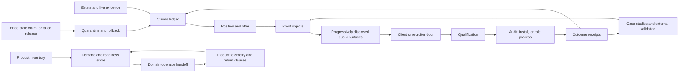

# Production-Systems Positioning Program

This directory is the canonical execution index for turning the estate into a credible,
evidence-backed public identity, an inbound commercial system, a repeatable delivery practice,
and eventually a governed software foundry whose products can be transferred to domain operators.

The program does **not** attempt to prove excellence by repository volume alone. It makes one
legible promise, supports it with progressively disclosed proof, converts qualified demand through
a bounded offer, and returns delivery evidence to the claims system.

## Canonical position

- Identity: **Production-systems architect**
- Headline: **I build production systems that solve expensive problems.**
- Authorship disclosure: **Architected and directed by one person through a governed, multi-agent
  production system.**
- Near-term commercial wedge: **Agentic Delivery Audit** for CTO, VP Engineering, and Head of
  Platform teams whose AI or agent initiatives are stalled, ungoverned, or untrustworthy.
- Long-term model: a governed software foundry in which a validated product can be operated by a
  domain partner rather than by its architect.
- Primary proof object: **Limen**.
- Public doors: **client** and **recruiter**. Operator partnership appears only after the visitor has
  entered the deeper proof layer.

Do not use repository count, contribution volume, or percentile language as an unqualified
substitute for quality or impact. The current profile already carries strong API-attested output
measurements, and LAVREA provides a contestable methodology for percentile floors. Those claims are
not rejected by fiat. The program adjudicates the measurement, the inference, and the prominence
separately. Unsupported revenue or adoption, “zero maintenance,” “best in the world,” and an
unsupported COO title remain prohibited. Stronger language is earned through reproducible evidence.

## The there-and-back system



“There” is the path from raw estate evidence to a public surface, a qualified conversation, and a
delivered outcome. “Back” is mandatory: every result, objection, incident, and operator metric
returns to its source ledger, updates what may be claimed, and either strengthens, narrows, or
withdraws the public story.

## Sources of truth

| Concern | Canonical owner |
|---|---|
| Program graph and work definitions | `institutio/positioning/program.yaml` |
| GitHub issue identifiers | `institutio/positioning/github-map.json` |
| Human-readable issue index | `docs/positioning/program/ISSUE-INDEX.md` |
| Validated chunk order and copy/paste prompts | `docs/positioning/program/EXECUTION-CHUNKS.md` |
| Positioning claims | `docs/positioning/claims-ledger.md` after PR #2136 lands |
| Research challenges and live adjudication | `docs/positioning/program/RESEARCH-ADJUDICATION.md` |
| Public/private estate classification | `docs/positioning/estate-classification.md` after PR #2136 lands |
| Human-only actions | `his-hand-levers.json` and its existing GitHub issues |
| URL ownership | `institutio/identity/url-map.yaml` |
| Public link health | `link-surfaces.json` |
| Agent authority, leases, and receipts | the Limen conduct broker and `WorkPacketV1` protocol |

GitHub issues are a projection of the program manifest. They are not a second source of truth, and
they are not permission to bypass the conduct broker. The reconciler identifies every object with
a stable HTML marker, repairs drift idempotently, and never edits `tasks.yaml`.

## Phases and gates

| Phase | Purpose | Exit gate |
|---|---|---|
| P00 | Program control plane | Manifest, validator, issue projection, relay contract, and orphan check are green |
| P01 | Foundation repair | Shared CI defect is fixed; PRs #2136 and #2141 are merged or have explicit terminal owners |
| P02 | Truth and evidence | Every material claim is sourced, dated, reproducible, classified, and withdrawable |
| P03 | Position and narrative | One identity and two doors survive target-reader comprehension tests |
| P04 | Commercial offers | Audit, install, and retainer have bounded scope, exclusions, qualification, and internal economics |
| P05 | Proof production | Six proof classes exist, beginning with the Limen engineering report |
| P06 | Portfolio experience | Progressive-disclosure design is tested, accessible, responsive, and approved |
| P07 | Public surfaces | Profile, organization, portfolio, resume, repositories, URLs, and rollback rails are coherent |
| P08 | Inbound capture | Tagged capture routes safely into a private pipeline and never sends without authority |
| P09 | Content and distribution | One flagship report and its derived assets are staged, published by the owner, and measured |
| P10 | Qualification and conversion | Client and recruiter conversations follow evidence-backed, repeatable playbooks |
| P11 | Delivery system | The audit, install, and retainer can be delivered with security, QA, and closeout receipts |
| P12 | External validation | Real conversations and delivery outcomes either validate the wedge or produce a documented revision |
| P13 | Foundry and operator handoff | Products are scored; one handoff is piloted or explicitly rejected by evidence-backed criteria |
| P14 | Return loop and Omega | Two unchanged end-to-end checks show no orphan packet, stale claim, broken surface, or unowned result |

## Execution order

Issue numbers are identifiers, not execution order. The canonical 13 chunks are generated in
`EXECUTION-CHUNKS.md`, but chunk and phase arrows govern aggregate proof and closeout rather than
leaf admission. Each leaf's explicit `depends_on` list is the executable readiness contract. This
allows every independent reversible leaf to proceed while a human-gated sibling remains open,
without allowing a phase, chunk, or Omega to close out of order.

P10 and P12 deliberately interleave. Build P10-W01 through P10-W07 first; then P12-W01 and W02
unlock P10-W08 while the remaining P12 evidence work proceeds. P12 therefore depends on P09 and
P11 at phase level, while its leaf dependencies enforce the required completed P10 work. This
avoids the former impossible condition in which P12 waited for all of P10 while P10-W08 waited for
P12-W02.

## Delivery waves

The dates are planning envelopes, not permission to skip dependencies.

- **Wave A — days 0–14:** P00–P05. Repair the foundation, merge the truth controls, settle the
  position and offers, and produce the first flagship proof.
- **Wave B — days 15–30:** P06–P09. Design and build the front door, activate safe capture, and
  stage the proof-led publication system.
- **Wave C — days 31–90:** P10–P12, interleaved by leaf dependency. Build conversion through
  P10-W07, deliver the first engagement through P12-W02, then adjudicate P10-W08 and finish the
  external-proof leaves.
- **Wave D — months 4–12:** P13–P14. Score the product estate, pilot an operator transfer, and
  prove that the whole system learns, rolls back, and reaches a repeatable fixed point.

The 90-day commercial success test is at least five qualified door-mails and either one paid audit
or five documented “no” outcomes whose reasons produce an explicit offer or positioning decision.
Do not commission another broad research pass before ten qualified conversations, the first paid
engagement, or strong contradictory evidence. Research is reopened by evidence, not anxiety.

## Assigned model and effort

Every root, phase plan, and work issue carries one explicit Codex model and reasoning-effort
assignment under the owner’s 2026-08-09 override. The assignment is visible in the issue body,
labels, generated index, ready-work output, and packet seed. Before execution, validate all 127
pairs against the current local catalog:

```bash
python3 scripts/positioning-program.py --verify-model-assignments
```

The base work matrix is:

| Work class | Assigned model | Effort |
|---|---|---|
| Routine read | `gpt-5.4-mini` | `low` |
| Routine write | `gpt-5.6-luna` | `medium` |
| Routine external | `gpt-5.6-terra` | `high` |
| Deep read/write | `gpt-5.6-terra` | `high` |
| Deep external or sensitive/multi-repository | `gpt-5.6-sol` | `xhigh` |
| Frontier review | `gpt-5.6-sol` | `max` |
| Root plan, P14 plan, and final Omega proof | `gpt-5.6-sol` | `ultra` |

Phase plans have explicit overrides in the manifest. Security, privacy, legal, conduct, and
multi-repository leaves are promoted above their ordinary matrix row. If an assigned pair is no
longer in the live catalog, the leaf fails blocked and the manifest receives a new explicit
assignment; agents never silently substitute another model.

Each leaf also retains one of three reasoning classes:

- `routine`: mechanical collection, link repair, rendering, straightforward implementation, or QA;
- `deep`: architecture, nontrivial diagnosis, offer design, data interpretation, or cross-repo work;
- `frontier_review`: a bounded challenge pass at a high-consequence decision or publication gate.

Frontier review is reserved for the identity decision, offer contract, flagship proof, experience
approval, 90-day strategy review, and first operator-transfer terms. Fable remains an optional,
acceptance-gated plan-only challenge pass; it is not the default executor and never performs the
build. Routine agents can perform the majority of the program from the explicit issue assignment.

## How any agent resumes

1. Read this file and `AGENT-RUNBOOK.md`.
2. Run `python3 scripts/positioning-program.py --check`.
3. Run `python3 scripts/positioning-program.py --ready --json`; this is the authoritative leaf-level
   admission result.
4. Read `EXECUTION-CHUNKS.md`, select the conductor whose resolved scope contains a ready leaf, and
   run `python3 scripts/positioning-program.py --chunk <CHUNK-ID>`. Multiple ready chunks may run in
   isolated lanes even while their aggregate predecessor phases remain open.
5. Register and claim through the Limen conduct broker. Do not begin mutation if the broker cannot
   issue the required lease.
6. Work in an isolated worktree, meet the acceptance condition, and run a task-specific executable
   check that is narrower than the issue’s receipt verifier.
7. Generate and post the structured receipt, run `--verify-work <WORK-ID>`, and close the issue only
   when that executable predicate passes. Then recalculate downstream readiness.
8. If the lane ends first, write the relay envelope described in `RELAY-TEMPLATE.md`; the next agent
   continues from the issue and receipt, not from a private transcript.

## Commands

```bash
python3 scripts/positioning-program.py --check
python3 scripts/positioning-program.py --render
python3 scripts/positioning-program.py --sync
python3 scripts/positioning-program.py --sync --apply
python3 scripts/positioning-program.py --verify-remote
python3 scripts/positioning-program.py --verify-model-assignments
python3 scripts/positioning-program.py --render-chunks
python3 scripts/positioning-program.py --chunk PSP-C00
python3 scripts/positioning-program.py --ready --json
python3 scripts/positioning-program.py --seed PSP-P01-W01
python3 scripts/positioning-program.py --receipt-template PSP-P01-W01
python3 scripts/positioning-program.py --verify-work PSP-P01-W01
```

`--sync` is a dry run. `--apply` creates or updates labels, the milestone, and the issue graph, then
writes the deterministic issue-number map. It never closes issues, merges pull requests, publishes
content, sends messages, changes DNS, spends money, or accepts legal terms.

## Omega

The program is complete only when:

- every leaf is closed with a valid successful receipt; blocked or superseding work has been
  resolved into its durable owner before closure;
- every phase exit gate is reproducible from live state;
- all public claims are current and evidence-linked, and all tracked links resolve;
- the inbound route, no-send invariant, delivery closeout, and rollback route each pass end to end;
- the 90-day demand decision is recorded from actual outcomes;
- the foundry lane has one observed operator-transfer result or an evidence-backed no-go receipt;
- two consecutive remote parity checks report the same complete graph with zero duplicate,
  missing, or orphan markers.

Completion is not “the website shipped.” It is a closed, inspectable system that can be continued
by a different agent without loss of intent and corrected without rebuilding the story from memory.
